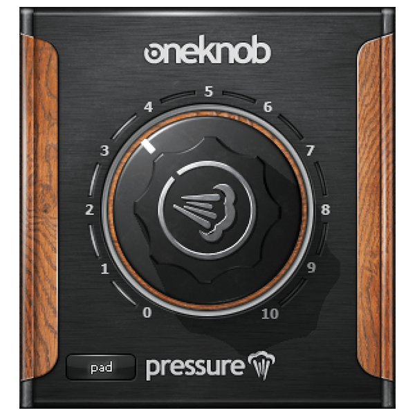

# G3X Pressure

Compressor de caráter com um macrocontrole, planejado em C++20, JUCE e CMake.
A entrega inicial será VST3 64-bit para Windows e Standalone para desenvolvimento.

**Estado:** M0 — definição aguardando confirmação.

- [PRD](PRD.md)
- [Referência visual e fontes](docs/references/README.md)

O produto será funcionalmente inspirado no fluxo de um controle, mas terá DSP,
marca, código, interface, textos e presets originais.

